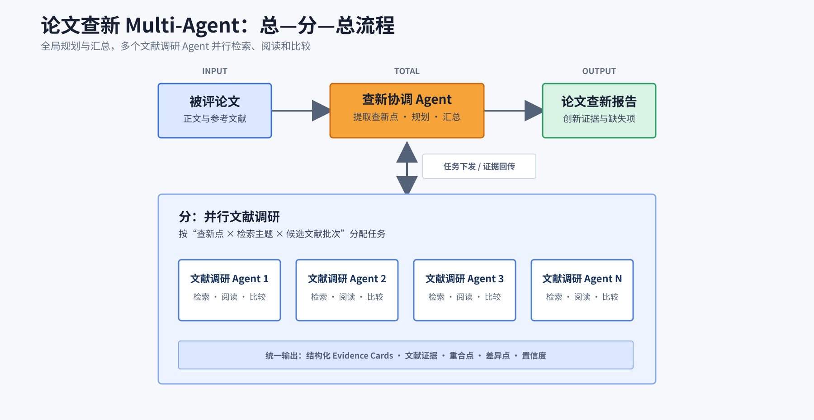

# 论文查新 Multi-Agent 框架

独立的论文查新框架，使用 LangGraph 实现“全局规划—并行文献调研—证据汇总”的总分总流程。



## 项目结构

```text
backend/src/novelty_agent_framework/   后端源码，按职责拆分 Agent、模型、工作流、接口和适配器
frontend/                              预留前端资源
examples/                      示例论文输入
tests/                         工作流与接口测试
docs/                          设计方案和代码说明
assets/                        流程图
```

## 运行

```powershell
conda activate langgraph
cd D:\novelty-multi-agent-framework
pip install -e ".[dev,web]"
pytest
novelty-demo --input examples\paper.json --output output\result.json
```

可选接口启动命令：

```powershell
python -m novelty_agent_framework.main
```

- [代码框架说明](docs/code-framework.md)
- [V0 设计方案](docs/design-v0.md)

当前 Adapter 装配确定性的 Demo Agent，只用于验证框架闭环。
